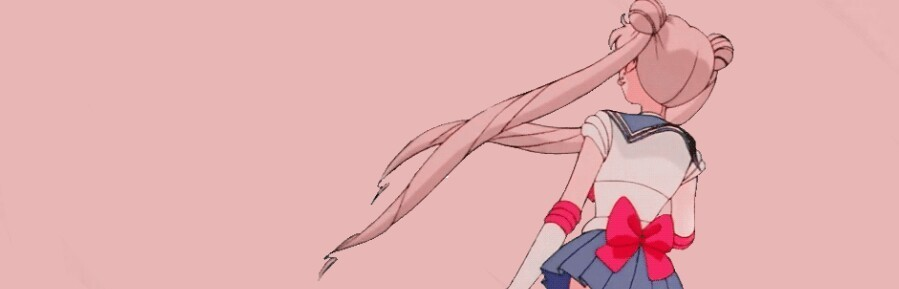

  

# Relación 3 parte 2 - Lenguaje de Marcas
## Contenido

>  **Carpetas con ejercicios html** de los ejercicios 1-8
>  
>  >  **Carpeta css con .css del ejercicio**
>  >  
>  >  **Carpeta img con imágenes del ejercicio**
>  >  
>  **Carpeta doc** con .pdf de los enunciados y cabecera de README.md
>    
>  **Archivo README.md**

## Hecho por

* **Roberto Torcal Aznal** - *Trabajo de LMSGI de 1ASIRA* - [mi github](https://github.com/torcalaznalroberto)
